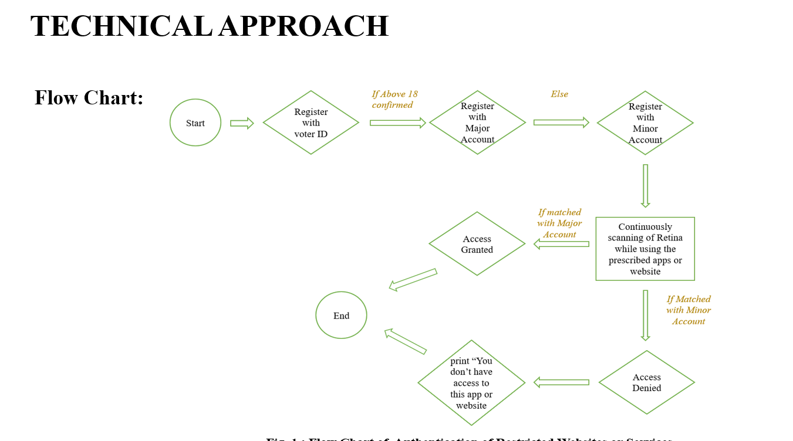

# Biometric Access Control and Content Filtering System (Concept)

## Overview
This project outlines the architecture for a software solution designed to foster healthier online habits and combat digital addiction among youth. The system restricts access to unauthorized websites, online gaming, and gambling by utilizing a dual-layer authentication process: government-issued ID verification and continuous biometric monitoring. Built as a secure, domestic alternative to foreign software, it prioritizes local data security.

## Proposed System Architecture
The authentication flow operates on strict access control logic:
* **Identity Verification:** Initial user registration and age verification are processed using a Voter ID.
* **Continuous Authentication:** If an adult attempts to access restricted content, the system initiates continuous facial or iris scanning.
* **Session Management:** The system scans the user's face or iris every one minute; if the biometric scan fails to match the authorized major account, the session is immediately terminated or access is denied.

## Proposed Tech Stack
* **Core Logic:** Python (Backend and Frontend components).
* **Hardware Integration:** Mobile device or laptop cameras for facial/iris recognition.
* **Security Protocols:** 2048-bit RSA SSL encryption for secure data transmission.
